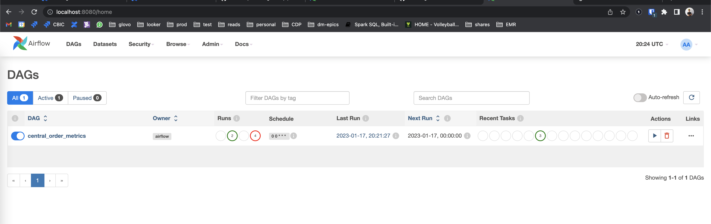
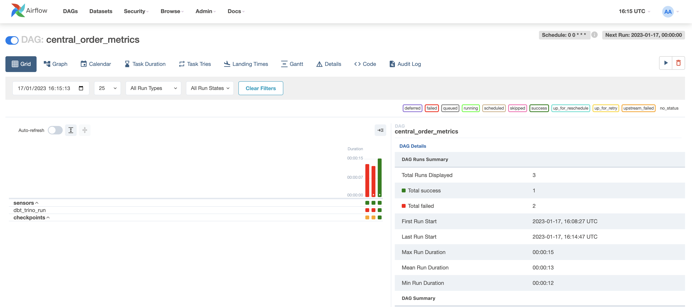
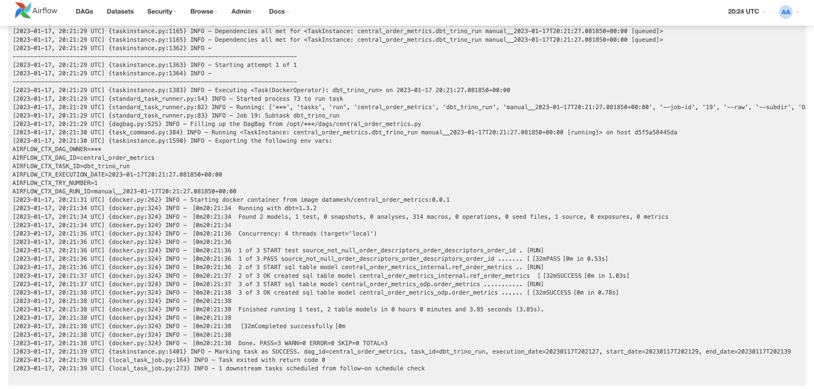

# Pyspark - Airflow batch approach

## Steps to run local - local (Airflow)

1. cd into <repo>/pyspark_airflow
2. `sh start.sh` or './start.sh'. This will:
    1. docker compose up (will build if the images are not built)
    2. Fix permissions on airflow worker to be able to share docker.sock with host PC
    3. Export ABSOLUTE_PATH_DIR and AIRFLOW_UID needed for Airflow to run correctly
3. Go to http://localhost:8080 and use `airflow` as user and `airflow` as password to enter Airflow Webserver
4. Trigger `customer_contacts_pipeline`
5. Data will be left in minio storage

## Sandbox DEV

(You will need to change the `some_email@domain.com` in `src/profiles.yml` email by yours)
1. (inside dbt-trino-airflow/) run the following on the terminal: `dbt build --target=sandbox-development
--profiles-dir . --project-dir src`
2. Oauth will redirect you to your webserver, no need to do anything. If you go back to the terminal, the code will be
executed in Starburst DEV.

## Sandbox PROD

Same as `sandbox-development`, but running `dbt build --target=sandbox-production --profiles-dir .
--project-dir src` instead

## Infrastructure
Everything is managed by docker-compose, but you will still need to build the `data-engineering/pyspark-engine-local:0.0.1`
docker image used in Docker Operators in Airflow (part of the sh.start process, no need to do anything)

### Docker containers
All of them need to share the same network or they won't be able to see/use/connect to each other hostnames

- postgres: Airflow DB, that maintains the state for Airflow runs, users and Airflow configs
- redis: task broker for Celery, Airflow's executor mode (CeleryExecutor)
- airflow-webserver: Starts Airflow with command `airflow webserver` and opens port 8080 to host
- airflow-scheduler: Starts scheduler for Airflow, the one responsible for tasks to get picked and run
- airflow-worker: The one actually running the tasks
- airflow-triggerer: New in Airflow 2.2.X, useful for sensors not to block a whole executor. As it's not used, it will
be commented out in the docker-compose file.
- airflow-init: Needed to start `postgres` state (create tables and airflow user for webserver)
- airflow-cli: Executed with `docker compose --profile debug up`. Interesting to start a CLI with Airflow commands and
test out configs and different commands
- flower: Executed with `docker-compose --profile flower up`. Flower is a web UI to manage Celery clusters.
- airflow-variables: airflow container that sets needed variables for dbt to work in docker-in-docker in as an Airflow
task
- trino-coordinator: Trino query engine, available on port 8081
- mariadb: MySQL ported DB to work as the database for hive catalog
- hive-metastore: hive metastore, where `spark-thrift-server` and Docker Operators running pyspark will connect and
create tables / read tables.
- minio: used as local storage, mimicking AWS s3 storage
- minio-init: sets up the local storage and creates a bucket named `central`
- table-setup: sets up the initial tables using dbt seed with a specific target

## Docker recommended settings
- CPUs: 6
- Memory: 10g
- Swap: 1.5g
- Disk image size: 150g
