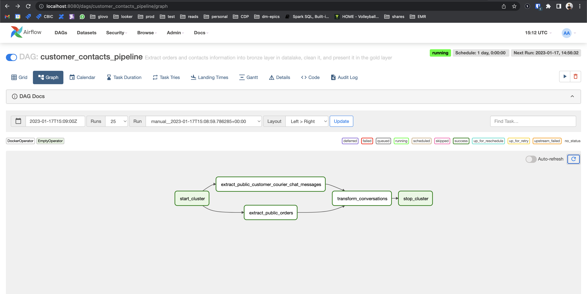
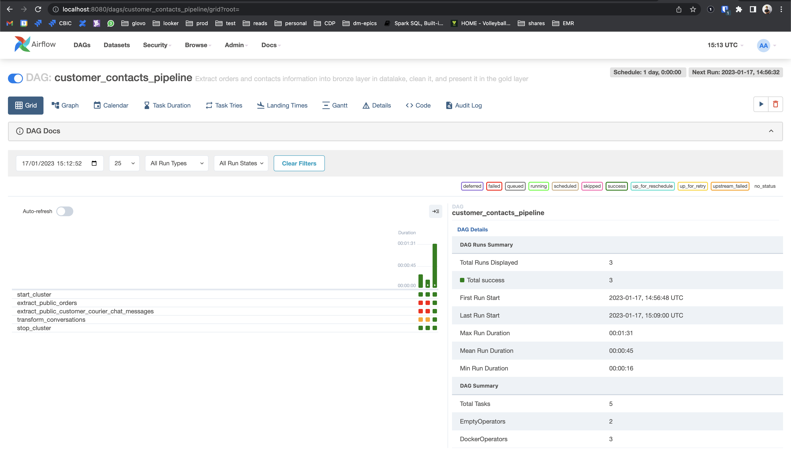
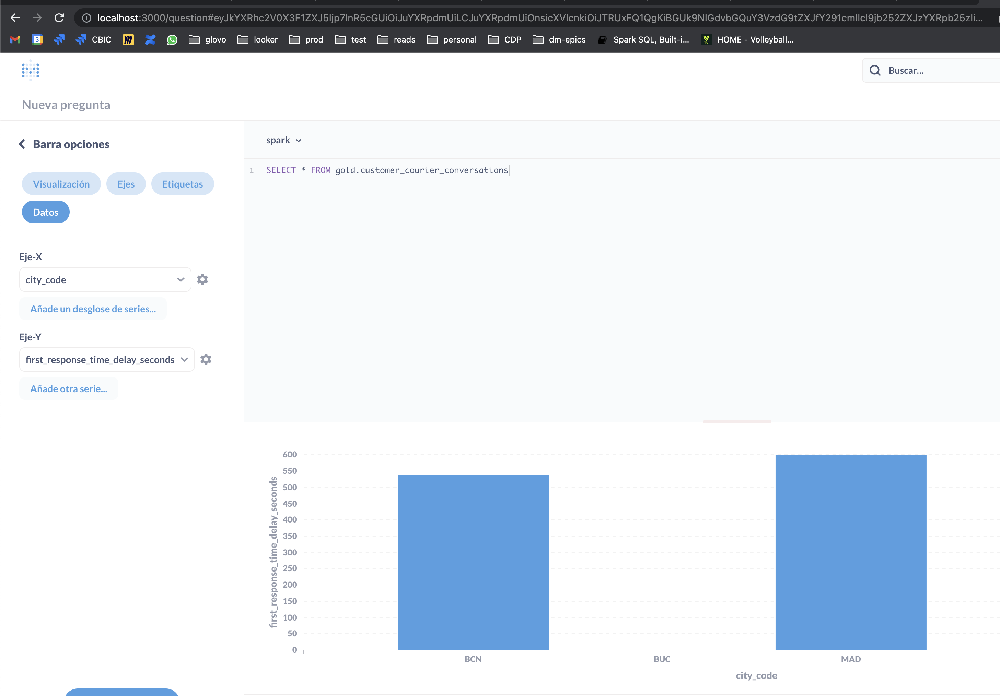
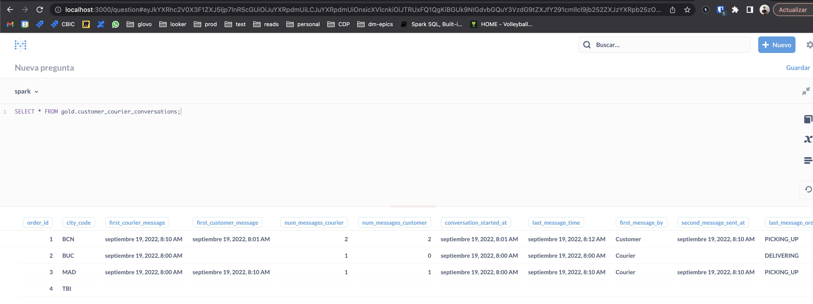

# Pyspark - Airflow batch approach

## Steps to run

1. cd into <repo>/pyspark_airflow
2. `sh start.sh` or './start.sh'. This will:
    1. docker compose up (will build if the images are not built)
    2. Fix permissions on airflow worker to be able to share docker.sock with host PC
    3. Export ABSOLUTE_PATH_DIR and AIRFLOW_UID needed for Airflow to run correctly
3. Go to http://localhost:8080 and use `airflow` as user and `airflow` as password to enter Airflow Webserver
4. Trigger `customer_contacts_pipeline`
5. Data will be left at `<repo>/pyspark_airflow/spark-warehouse/`
    i. bronze schema is meant for raw extracts from sources
    ii. silver for refined/clean tables, ready for engineers to grab and transform
    iii. gold for presentation schema, where metabase, Data Analysts and Data Scientists should be looking at
6. Go to `http://localhost:3000` to connect to Metabase and do queries with a Spark Thrift Server container connected to
the same hive metastore as Airflow pyspark containers. To connect to spark-thrift-server, use the following connection
details:
    - host: spark-thrift-server
    - port: 10001
    - database: gold
    - user: spark
    - password: <leave empty>

## Images

## Infrastructure
Everything is managed by docker-compose, but you will still need to build the `data-engineering/pyspark-engine-local:0.0.1`
docker image used in Docker Operators in Airflow (part of the sh.start process, no need to do anything)

### Docker containers
All of them need to share the same network or they won't be able to see/use/connect to each other hostnames

- postgres: Airflow DB, that maintains the state for Airflow runs, users and Airflow configs
- source-postgres: DB where source tables live (`orders` and `customer_courier_chat_messages` tables)
- redis: task broker for Celery, Airflow's executor mode (CeleryExecutor)
- airflow-webserver: Starts Airflow with command `airflow webserver` and opens port 8080 to host
- airflow-scheduler: Starts scheduler for Airflow, the one responsible for tasks to get picked and run
- airflow-worker: The one actually running the tasks
- airflow-triggerer: New in Airflow 2.2.X, useful for sensors not to block a whole executor. As it's not used, it will
be commented out in the docker-compose file.
- airflow-init: Needed to start `postgres` state (create tables and airflow user for webserver)
- airflow-cli: Executed with `docker compose --profile debug up`. Interesting to start a CLI with Airflow commands and
test out configs and different commands
- flower: Executed with `docker-compose --profile flower up`. Flower is a web UI to manage Celery clusters.
- mariadb: MySQL ported DB to work as the database for hive catalog
- hive-metastore: hive metastore, where `spark-thrift-server` and Docker Operators running pyspark will connect and
create tables / read tables.
- spark-thrift-server: Starts a Spark Thrift Server to be able to query information in the DL
- metabase: Visualization tool to see data, uses spark-thrift-server as query engine

## Next steps
- Create a Spark cluster that pyspark connects to (closer to production)
- Better handling of image versioning
- Feed events with kafka/redis instead of postgres

## Docker recommended settings
- CPUs: 6
- Memory: 10g
- Swap: 1.5g
- Disk image size: 150g
